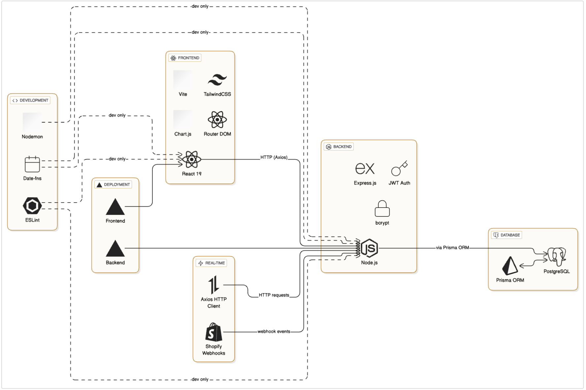
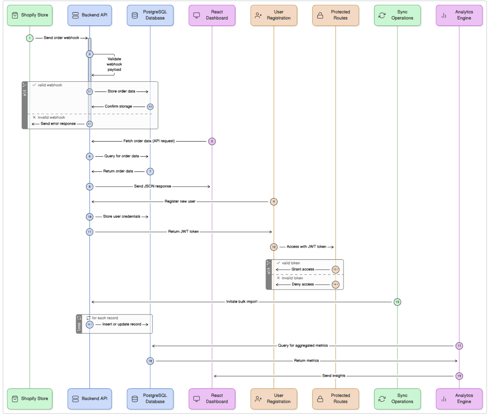
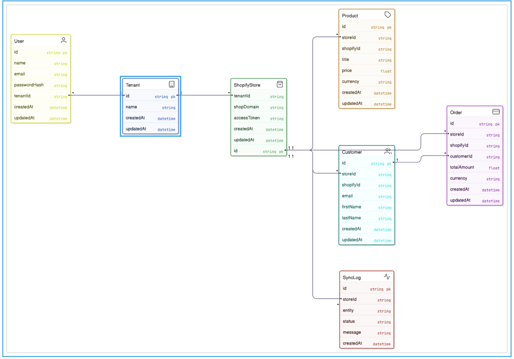

# Proxeno - Advanced Shopify Analytics & Business Intelligence Platform

Proxeno is a comprehensive, enterprise-grade SaaS platform that transforms Shopify store data into actionable business insights. Built with a modern tech stack, it provides multi-tenant architecture, real-time data synchronization, and sophisticated analytics to help e-commerce businesses make data-driven decisions.

## 🚀 Live Demo

* **Frontend Dashboard**: [proxeno.com](https://itsharshpro-xenofrontend.vercel.app)
* **Backend API**: [backend.proxeno.com](https://itsharshpro-xenobackend.vercel.app/)
* **Demo Video Link**: [video](https://youtu.be/LvBaR_dkHEs)

## ✨ Key Features

### 🔐 Authentication & User Management
- **Secure User Registration & Login**: JWT-based authentication with bcrypt password hashing
- **Multi-Tenant Architecture**: Automatic tenant creation for new users with complete data isolation
- **Protected Routes**: Role-based access control for dashboard and API endpoints

### 🔄 Data Synchronization
- **Comprehensive Data Ingestion**: Syncs Products, Customers, and Orders from Shopify stores
- **Real-Time Webhooks**: Instant updates for order creation and customer registration events
- **Bulk Import**: Paginated API calls for efficient large dataset synchronization
- **Sync Logging**: Complete audit trail of all synchronization operations with status tracking

### 📊 Advanced Analytics Dashboard
- **Executive Summary Cards**: Key metrics including revenue, orders, customers, and products
- **Interactive Charts**: Revenue trends, customer growth, and peak order hours visualization
- **Date Range Filtering**: Customizable date ranges for focused analysis
- **Business Intelligence**: Advanced metrics including AOV, retention rates, and growth trends

### 📈 Business Intelligence Features
- **Revenue Trends**: Period-over-period comparison with growth percentages
- **Customer Analytics**: Growth tracking, retention rates, and spending patterns
- **Peak Performance Analysis**: Identify peak order hours and optimize operations
- **Top Customer Insights**: Identify and analyze highest-value customers

### 🛠 Technical Excellence
- **RESTful API**: Well-structured endpoints with comprehensive error handling
- **Database Optimization**: Indexed queries and efficient data relationships
- **Real-Time Updates**: Webhook-driven synchronization for instant data updates
- **Export Capabilities**: Data export functionality for external analysis

## 🛠 Tech Stack



## 🏗 Architecture Overview

Proxeno follows a modern, scalable three-tier architecture designed for enterprise-level performance and security.

### System Components

1. **Shopify Stores**: Primary data sources that trigger webhooks for real-time updates
2. **Backend API (Node.js/Express)**: 
   - JWT-based authentication and authorization
   - Webhook processing and data validation
   - RESTful API endpoints for analytics
   - Multi-tenant data isolation
3. **PostgreSQL Database**: 
   - Hosted on Supabase with Prisma ORM
   - Optimized schemas with proper indexing
   - Complete audit logging
4. **React Dashboard**: 
   - Modern SPA with protected routes
   - Real-time analytics visualization
   - Responsive design with TailwindCSS

### Data Flow Architecture



## 📊 Database Schema



## 🚀 API Endpoints

### Authentication Endpoints
| Method | Endpoint | Description | Authentication |
|--------|----------|-------------|----------------|
| `POST` | `/auth/register` | Register new user and create tenant | Public |
| `POST` | `/auth/login` | User login and JWT token generation | Public |

### Tenant & Store Management
| Method | Endpoint | Description | Authentication |
|--------|----------|-------------|----------------|
| `POST` | `/tenant` | Create new tenant (legacy endpoint) | Protected |
| `POST` | `/shopify/connect` | Connect Shopify store to tenant | Protected |
| `GET` | `/shopify/stores` | Get all stores for authenticated tenant | Protected |

### Data Synchronization
| Method | Endpoint | Description | Authentication |
|--------|----------|-------------|----------------|
| `POST` | `/sync/products` | Manual sync of all store products | Protected |
| `POST` | `/sync/customers` | Manual sync of all store customers | Protected |
| `POST` | `/sync/orders` | Manual sync of all store orders | Protected |

### Analytics & Metrics
| Method | Endpoint | Description | Authentication |
|--------|----------|-------------|----------------|
| `GET` | `/metrics/{tenantId}/summary` | High-level business metrics | Protected |
| `GET` | `/metrics/{tenantId}/revenue-over-time` | Time-series revenue data | Protected |
| `GET` | `/metrics/{tenantId}/orders-by-date` | Daily order and revenue breakdown | Protected |
| `GET` | `/metrics/{tenantId}/top-customers` | Top 5 customers by total spend | Protected |
| `GET` | `/metrics/{tenantId}/advanced-metrics` | Advanced business intelligence metrics | Protected |
| `GET` | `/metrics/{tenantId}/revenue-trends` | Period-over-period growth analysis | Protected |

### Webhooks
| Method | Endpoint | Description | Authentication |
|--------|----------|-------------|----------------|
| `POST` | `/webhooks/shopify` | Receive real-time Shopify webhook events | Public (Verified) |

### Health & Status
| Method | Endpoint | Description | Authentication |
|--------|----------|-------------|----------------|
| `GET` | `/` | Basic server status | Public |
| `GET` | `/health` | Detailed health check | Public |

## 📈 Analytics Features

### Executive Dashboard Metrics
- **Total Revenue**: Comprehensive revenue tracking with period comparisons
- **Order Analytics**: Order count, average order value, and trends
- **Customer Insights**: Customer acquisition, retention, and lifetime value
- **Product Performance**: Product catalog size and performance metrics

### Advanced Business Intelligence
- **Revenue Growth Analysis**: Period-over-period revenue comparison with percentage growth
- **Customer Retention Rate**: Percentage of customers who make repeat purchases
- **Peak Performance Hours**: Identify optimal business hours based on order volume
- **Customer Growth Tracking**: Daily new customer acquisition trends

### Interactive Visualizations
- **Revenue Chart**: Time-series line chart showing revenue trends over customizable date ranges
- **Customer Growth Chart**: Line chart displaying customer acquisition patterns
- **Peak Hours Chart**: Bar chart highlighting peak order hours for operational optimization
- **Top Customers List**: Ranked list of highest-value customers with spending details

### Data Export & Filtering
- **Date Range Filtering**: Customizable date ranges for focused analysis
- **Export Capabilities**: Download analytics data for external analysis
- **Real-time Updates**: Live data updates through webhook integration

## 🛠 Local Development Setup

### Prerequisites
- **Node.js** (v18 or later)
- **npm** or **yarn**
- **Git**
- **PostgreSQL Database** (Recommended: [Neon](https://neon.tech/) for free hosted solution)

### 🔧 Backend Setup

1. **Clone the repository**:
   ```bash
   git clone https://github.com/itsharshpro/proxeno.git
   cd proxeno/backend
   ```

2. **Install dependencies**:
   ```bash
   npm install
   ```

3. **Environment Configuration**:
   Create a `.env` file in the `backend` directory:
   ```env
   # Database Configuration
   DATABASE_URL="your_neon_pooled_connection_string"
   DIRECT_URL="your_neon_direct_connection_string"
   
   # JWT Authentication
   JWT_SECRET="your_super_secret_jwt_key_here"
   
   # Server Configuration
   PORT=4000
   ```

4. **Database Setup**:
   ```bash
   # Generate Prisma client
   npx prisma generate
   
   # Run database migrations
   npx prisma migrate dev --name initial
   
   # Optional: View database in Prisma Studio
   npx prisma studio
   ```

5. **Start the development server**:
   ```bash
   npm run dev
   ```
   Server will be running at `http://localhost:4000`

### 🎨 Frontend Setup

1. **Navigate to frontend directory**:
   ```bash
   cd ../frontend
   ```

2. **Install dependencies**:
   ```bash
   npm install
   ```

3. **Environment Configuration**:
   Create a `.env` file in the `frontend` directory:
   ```env
   VITE_API_URL=http://localhost:4000
   ```

4. **Start the development server**:
   ```bash
   npm run dev
   ```
   Frontend will be available at `http://localhost:5173`

### 🧪 Testing the Application

1. **Register a new account** at `http://localhost:5173/register`
2. **Connect your Shopify store** using your store domain and access token
3. **Sync your data** using the manual sync options or set up webhooks
4. **Explore the analytics dashboard** with your real Shopify data

## 🚀 Production Deployment

### Backend Deployment (Vercel)

1. **Install Vercel CLI**:
   ```bash
   npm i -g vercel
   ```

2. **Configure vercel.json** (already included):
   ```json
   {
     "version": 2,
     "builds": [
       {
         "src": "src/server.js",
         "use": "@vercel/node"
       }
     ],
     "routes": [
       {
         "src": "/(.*)",
         "dest": "/src/server.js"
       }
     ]
   }
   ```

3. **Deploy**:
   ```bash
   cd backend
   vercel --prod
   ```

4. **Set environment variables** in Vercel dashboard:
   - `DATABASE_URL`
   - `DIRECT_URL`
   - `JWT_SECRET`

### Frontend Deployment (Vercel)

1. **Deploy frontend**:
   ```bash
   cd frontend
   vercel --prod
   ```

2. **Set environment variables**:
   - `VITE_API_URL=https://your-backend-url.vercel.app`

## 🔐 Shopify Integration Setup

### Setting up Shopify Webhooks

1. **In your Shopify Admin**, go to Settings → Notifications
2. **Add webhook endpoints**:
   - **Order creation**: `https://your-backend-url.vercel.app/webhooks/shopify`
   - **Customer creation**: `https://your-backend-url.vercel.app/webhooks/shopify`
3. **Set format to JSON**
4. **Configure webhook verification** (recommended for production)

### Getting Shopify API Credentials

1. **Create a Private App** in your Shopify store
2. **Enable necessary permissions**:
   - `read_products`
   - `read_customers`
   - `read_orders`
3. **Copy the Admin API access token**
4. **Use in the "Connect Store" form** in Proxeno dashboard

## 🔧 Technical Decisions & Trade-offs

### Architecture Choices
- **JWT Authentication**: Chosen over session-based auth for stateless API design and better scalability
- **Prisma ORM**: Selected for type safety, excellent development experience, and automatic migrations
- **Multi-tenant Single Database**: Efficient resource utilization with proper data isolation using tenant IDs
- **Webhook-first Synchronization**: Real-time updates prioritized over polling for better user experience

### Performance Optimizations
- **Database Indexing**: Strategic indexes on foreign keys and frequently queried fields
- **Paginated API Responses**: Efficient handling of large datasets during initial sync
- **Query Optimization**: Raw SQL for complex analytics queries to improve performance
- **Caching Strategy**: Frontend state management with React hooks for reduced API calls

### Security Considerations
- **Password Hashing**: bcrypt with salt rounds for secure password storage
- **JWT Expiration**: 24-hour token expiry with refresh token strategy recommended for production
- **Input Validation**: Comprehensive validation on all API endpoints
- **Tenant Isolation**: Strict data access controls preventing cross-tenant data leaks

## 🐛 Known Limitations & Future Improvements

### Current Limitations
1. **Shopify OAuth**: Simplified token-based auth instead of full OAuth 2.0 flow
2. **Single Store per Tenant**: Each tenant can connect only one Shopify store at a time
3. **Webhook Verification**: Basic webhook handling without cryptographic verification
4. **Rate Limiting**: No built-in rate limiting for API endpoints

### Planned Enhancements
- [ ] **Advanced Analytics**: Cohort analysis, customer segmentation, and predictive analytics
- [ ] **Multi-store Support**: Allow tenants to connect multiple Shopify stores
- [ ] **Real-time Notifications**: WebSocket integration for live dashboard updates
- [ ] **Data Export**: CSV/Excel export functionality for all analytics
- [ ] **API Rate Limiting**: Implement rate limiting with Redis
- [ ] **Audit Logging**: Comprehensive activity logging for security and compliance
- [ ] **Advanced Permissions**: Role-based access control within tenants
- [ ] **Mobile App**: React Native mobile application for on-the-go analytics

Built with ❤️ by [Harsh Gupta](https://github.com/itsharshpro)